# Phase 4 System Architecture

Comprehensive architecture documentation for Phase 4 Driver Dashboard features with visual diagrams.

---

## System Overview

Phase 4 integrates multiple external services to provide real-time driver tracking, notifications, and delivery management.

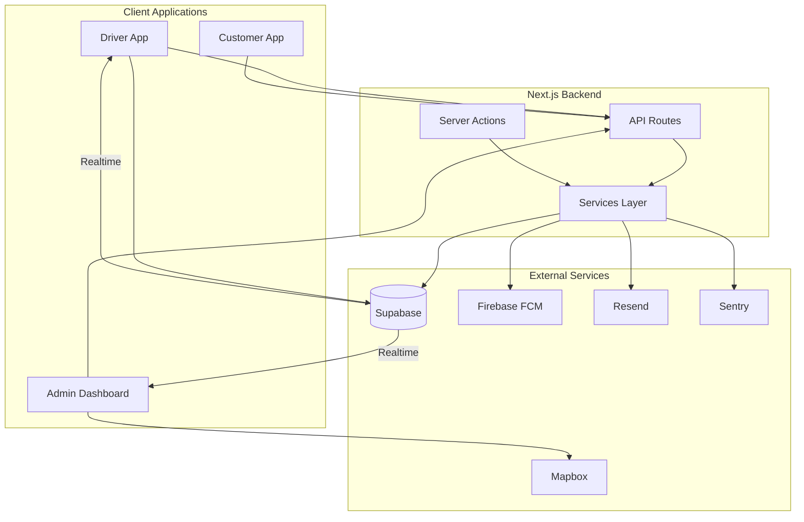

---

## 1. WebSocket Communication Flow

Real-time bidirectional communication between drivers, admin dashboard, and the backend using Supabase Realtime (Phoenix Channels).

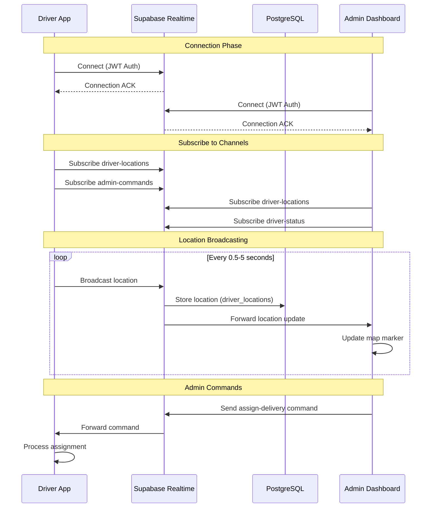

### Channel Architecture

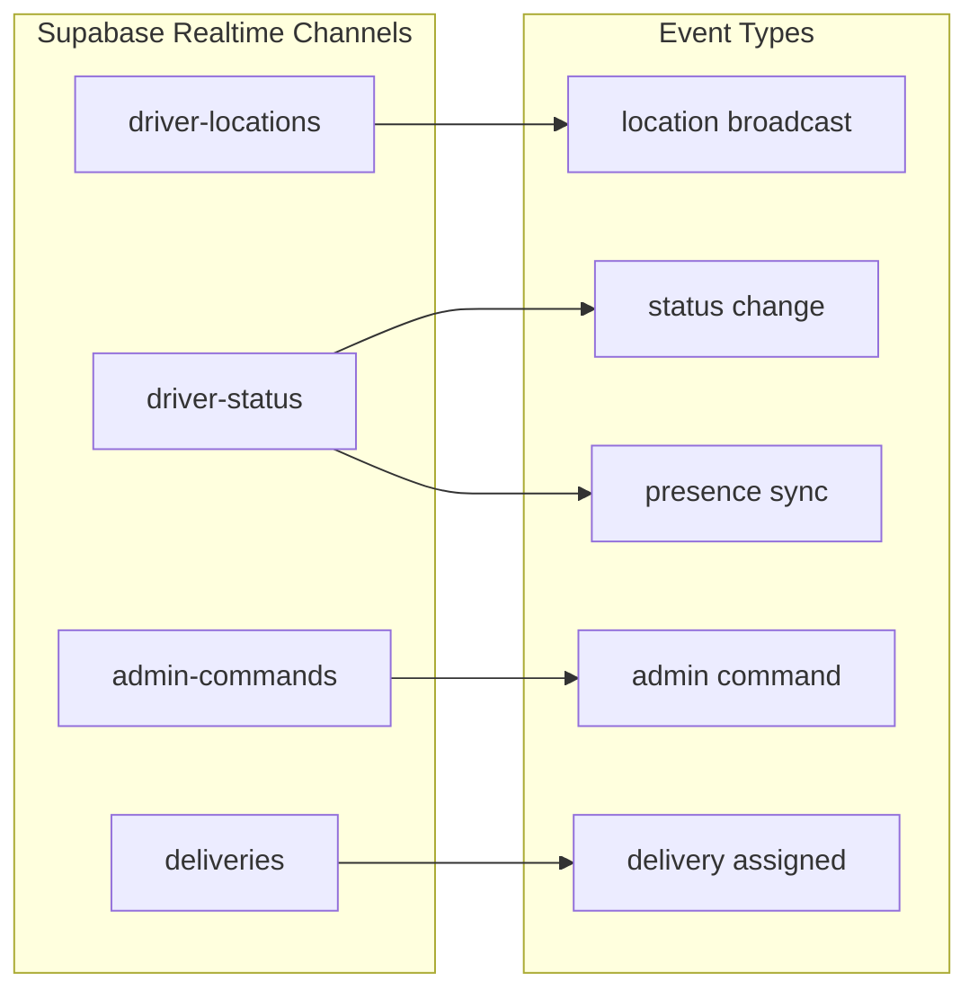

### Fallback Strategy

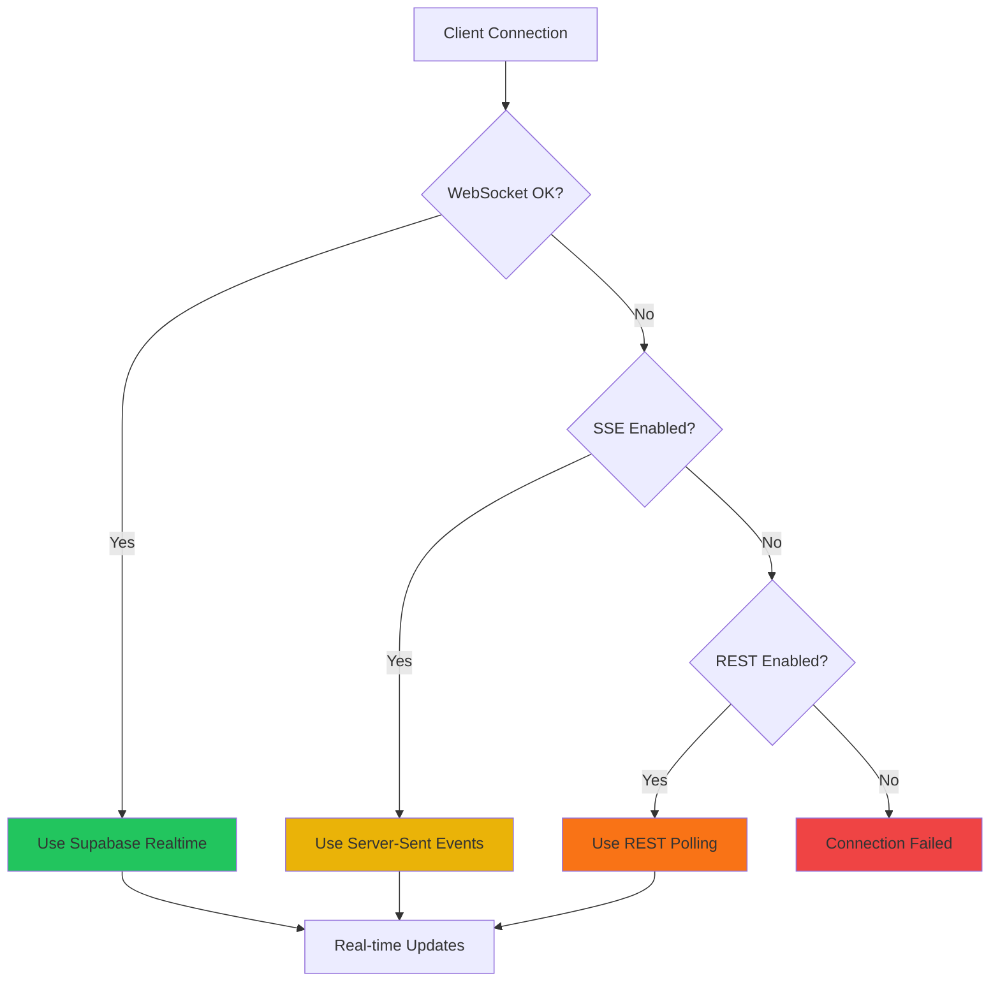

---

## 2. Notification Delivery Pipeline

Customer notifications via push (Firebase) and email (Resend) when delivery status changes.

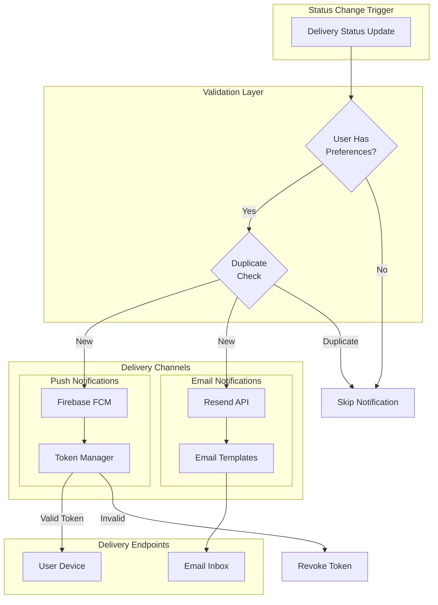

### Deduplication Logic

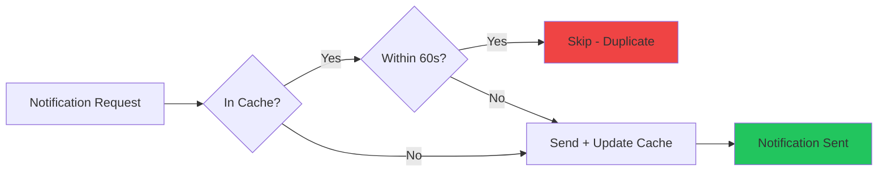

### Notification Events Matrix

| Status Change | Push | Email | Customer | Driver |
|--------------|------|-------|----------|--------|
| ASSIGNED | ✓ | - | - | ✓ |
| EN_ROUTE_TO_DELIVERY | ✓ | ✓ | ✓ | - |
| ARRIVED_AT_DELIVERY | ✓ | ✓ | ✓ | - |
| DELIVERED | ✓ | ✓ | ✓ | - |
| DELAYED | ✓ | ✓ | ✓ | - |
| FAILED | ✓ | ✓ | ✓ | ✓ |

---

## 3. GPS Tracking and Mileage Calculation

Driver location tracking and mileage calculation using PostGIS for accurate distance measurement.

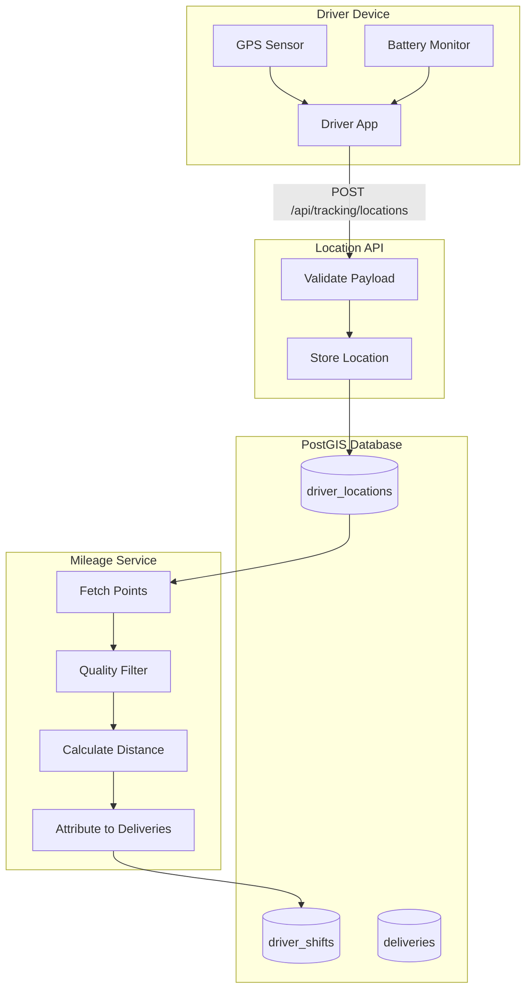

### Quality Filtering Pipeline

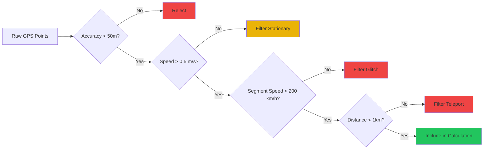

### Mileage Calculation Query

```sql
-- PostGIS distance calculation
SELECT SUM(
    ST_Distance(
        location::geography,
        LAG(location) OVER (ORDER BY recorded_at)::geography
    )
) / 1609.34 AS miles_driven
FROM driver_locations
WHERE shift_id = $1
  AND accuracy < 50
  AND speed > 0.5
ORDER BY recorded_at;
```

---

## 4. Photo Upload and Storage Flow

Proof of delivery photo capture, compression, and storage with offline support.

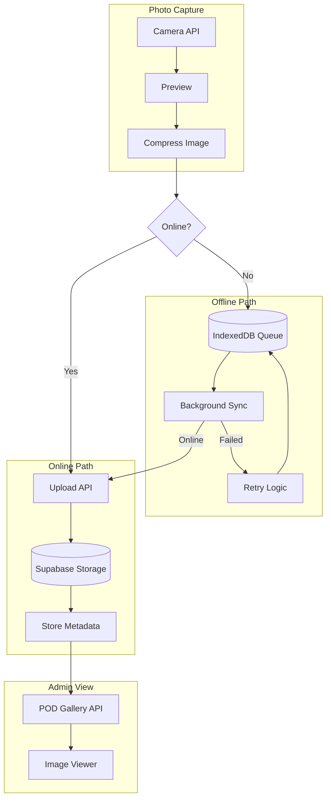

### Offline Queue Lifecycle

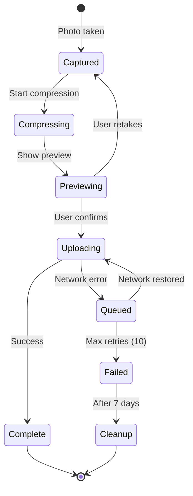

---

## 5. External Service Dependencies

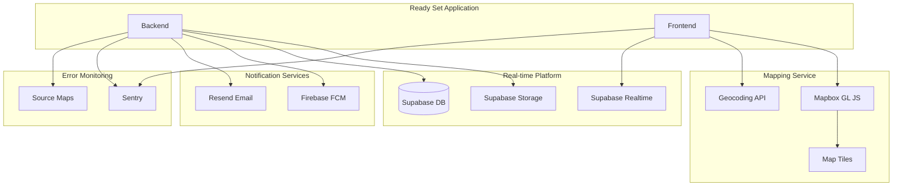

### Service Rate Limits and Quotas

| Service | Free Tier | Rate Limit | Notes |
|---------|-----------|------------|-------|
| Mapbox | 50K loads/month | N/A | Per-view pricing |
| Supabase Realtime | 200 connections | 100 msg/sec | Per project |
| Firebase FCM | Unlimited | 1K msg/sec | Token limits apply |
| Resend | 3K emails/month | 100/day | Free tier |
| Sentry | 5K errors/month | N/A | Per project |

---

## 6. Error Handling and Monitoring

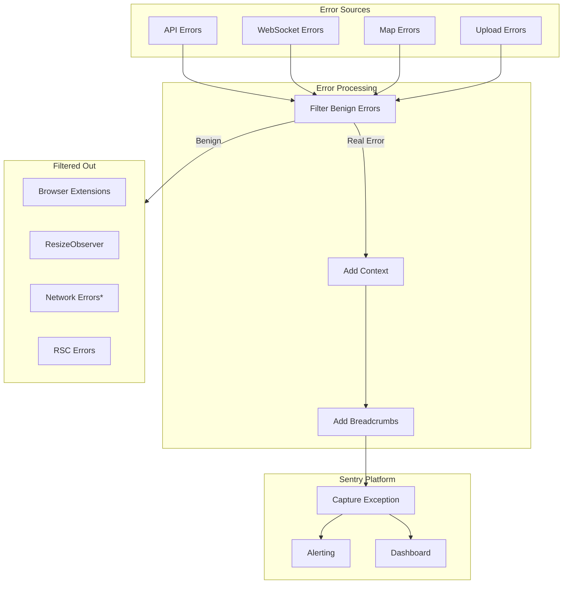

---

## Feature Flag Decision Points

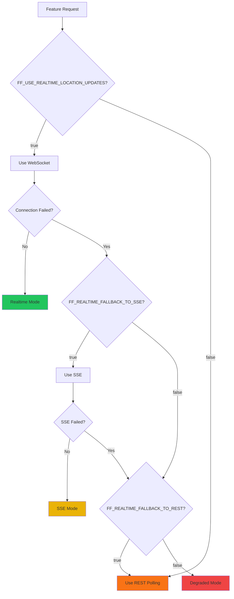

---

## Scaling Considerations

### Current Architecture Limits

| Component | Current Capacity | Scaling Strategy |
|-----------|-----------------|------------------|
| WebSocket Connections | 200 concurrent | Upgrade Supabase tier |
| Map Loads | 50K/month | Implement tile caching |
| Push Notifications | Unlimited | Token cleanup automation |
| Email Delivery | 3K/month | Upgrade Resend tier |
| GPS Points Storage | Unlimited | Archive old data |

### Recommended Optimizations

1. **Map Performance**
   - Implement marker clustering for >10 drivers
   - Cache static tiles
   - Use lower zoom levels on mobile

2. **Realtime Scaling**
   - Implement presence-based filtering
   - Reduce broadcast frequency for slow-moving drivers
   - Use room-based channels for geographic areas

3. **Storage Management**
   - Archive GPS data older than 90 days
   - Compress POD images to 1MB max
   - Implement CDN for frequently accessed images

---

## Related Documentation

- [Phase 4 Implementation Guide](phase-4-implementation-guide.md)
- [Deployment Checklist](deployment-checklist-phase-4.md)
- [Driver Dashboard Audit](driver-dashboard-audit-2025-01.md)
- [Quick Reference](driver-dashboard-quick-reference.md)
- [Test Plan](driver-dashboard-test-plan.md)

### Setup Guides

- [Mapbox Integration](setup/mapbox-integration.md)
- [WebSocket Setup](setup/websocket-setup.md)
- [Notifications Setup](setup/notifications.md)
