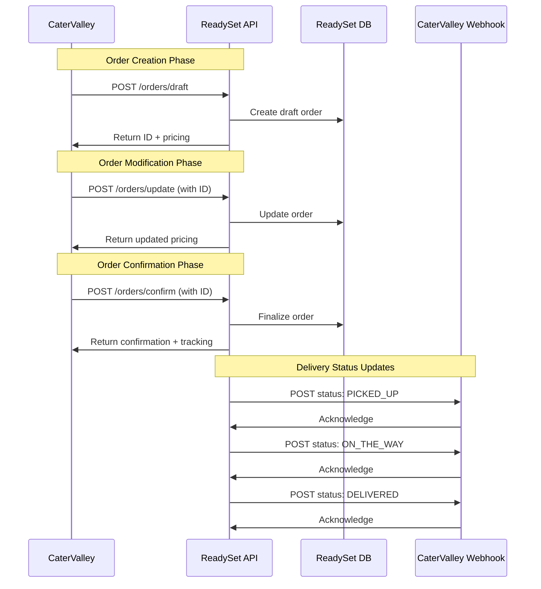

# CaterValley API Integration - Technical Specification

## Overview
This document outlines the technical requirements for the ReadySet-CaterValley API integration. The integration involves bidirectional communication:
- **CaterValley → ReadySet**: Draft orders, updates, and confirmations
- **ReadySet → CaterValley**: Courier status updates via webhook

---

## 1. ReadySet API Endpoints (Receive from CaterValley)

### Base URL
```
https://readysetllc.com/api/cater-valley
```

### Required Headers (All Requests)
```typescript
{
  "Content-Type": "application/json",
  "partner": "catervalley",
  "x-api-key": "ready-set"
}
```

### 1.1 Draft Order Endpoint
**Purpose**: Receive initial order data and return pricing quote

```
POST /orders/draft
```

**Request Payload** (from email context):
```typescript
interface DraftOrderRequest {
  orderCode: string;
  deliveryAddress: {
    name: string;
    address: string;
    city: string;
    state: string;
  };
  pickupLocation: {
    name: string;
    address: string;
    city: string;
    state: string;
  };
  deliveryTime: string; // Local time format (e.g., "11:00")
  priceTotal: number;
  items: Array<{
    name: string;
    quantity: number;
    price: number;
  }>;
}
```

**Expected Response**:
```typescript
interface DraftOrderResponse {
  id: string; // UUID from ReadySet database
  deliveryPrice: number;
  totalPrice: number;
  estimatedPickupTime: string; // UTC ISO 8601 format with Z suffix
  status: "SUCCESS" | "ERROR";
  breakdown: {
    basePrice: number;
    peakTimeMultiplier?: number;
    distanceTier?: string;
    headCountTier?: string;
    foodCostTier?: string;
    tipIncluded?: boolean;
    calculation?: string;
  };
  error?: string;
}
```

**Example Response**:
```json
{
  "id": "ac59dadb-0ca0-45f4-ab9e-2e009d3c5b3b",
  "deliveryPrice": 48.87,
  "totalPrice": 222.74,
  "estimatedPickupTime": "2025-06-11T18:30:00.000Z",
  "status": "SUCCESS",
  "breakdown": {
    "basePrice": 42.5,
    "peakTimeMultiplier": 1.15
  }
}
```

### 1.2 Update Order Endpoint
**Purpose**: Receive order modifications and return updated pricing

```
POST /orders/update
```

**Request Payload**:
```typescript
interface UpdateOrderRequest {
  id: string; // UUID returned from draft endpoint
  orderCode: string;
  deliveryAddress?: {
    name: string;
    address: string;
    city: string;
    state: string;
  };
  deliveryTime?: string;
  priceTotal?: number;
  items?: Array<{
    name: string;
    quantity: number;
    price: number;
  }>;
}
```

**Expected Response**: Same structure as DraftOrderResponse

### 1.3 Confirm Order Endpoint
**Purpose**: Finalize order and prepare for dispatch

```
POST /orders/confirm
```

**Request Payload**:
```typescript
interface ConfirmOrderRequest {
  id: string; // UUID from draft/update responses
  orderCode: string;
}
```

**Expected Response**:
```typescript
interface ConfirmOrderResponse {
  id: string;
  orderNumber: string; // CaterValley order number (e.g., "CV-ABC1234")
  status: "CONFIRMED" | "ERROR";
  message: string;
  estimatedDeliveryTime: string; // UTC ISO 8601
  driverAssignment: {
    expectedAssignmentTime: string; // UTC ISO 8601
    trackingAvailable: boolean;
  };
  error?: string;
}
```

**Example Response**:
```json
{
  "id": "ac59dadb-0ca0-45f4-ab9e-2e009d3c5b3b",
  "orderNumber": "CV-ABC1234",
  "status": "CONFIRMED",
  "message": "Order has been confirmed and is ready for dispatch",
  "estimatedDeliveryTime": "2025-06-11T19:15:00.000Z",
  "driverAssignment": {
    "expectedAssignmentTime": "2025-05-28T18:33:20.780Z",
    "trackingAvailable": true
  }
}
```

### 1.4 Status Check Endpoint
**Purpose**: Health check for API availability

```
GET /status
```

**Expected Response**:
```typescript
interface StatusResponse {
  status: "operational" | "degraded" | "down";
  timestamp: string;
  version?: string;
}
```

---

## 2. CaterValley Webhook (Send from ReadySet)

### Webhook URL (Production)
```
POST https://api.catervalley.com/api/operation/order/update-order-status
```

### Reference Documentation
https://documenter.getpostman.com/view/32527900/2sAYHxn3vs

### Webhook Payload
**Purpose**: Send courier status updates to CaterValley

```typescript
interface StatusUpdateWebhook {
  orderNumber: string; // CaterValley order number
  status: CourierStatus;
  timestamp: string; // UTC ISO 8601
  location?: {
    latitude: number;
    longitude: number;
  };
  notes?: string;
  driverInfo?: {
    name: string;
    phone: string;
  };
}

type CourierStatus = 
  | "PICKED_UP"      // Driver has picked up the order
  | "ON_THE_WAY"     // Driver is en route to delivery location
  | "ARRIVED"        // Driver has arrived at delivery location
  | "DELIVERED"      // Order has been delivered
  | "CANCELLED"      // Order was cancelled
  | "FAILED";        // Delivery failed
```

### Expected Webhook Response
```typescript
interface WebhookResponse {
  success: boolean;
  message?: string;
  timestamp: string;
}
```

---

## 3. Time Handling Requirements

### Critical Time Conversion Rules
1. **Input Times (from CaterValley)**: Local timezone (Pacific Time)
   - Simple format: `"11:00"`, `"18:30"`
   - No timezone suffix

2. **Output Times (to CaterValley)**: UTC timezone
   - ISO 8601 format with Z suffix: `"2025-06-11T18:30:00.000Z"`
   - Must handle daylight saving time conversions automatically

3. **Example Conversion**:
   ```typescript
   Input:  deliveryTime = "11:00" (Pacific Time)
   Output: pickupTime = "17:15:00.000Z" (UTC, accounting for -7/-8 hour offset)
   ```

---

## 4. Pricing Requirements

### Minimum Delivery Fee
**CRITICAL**: According to agreement, minimum delivery fee is **$42.50**

### Pricing Tiers (from email context)
Based on the pricing table mentioned in the email:

```typescript
interface PricingTiers {
  headCount: {
    "1-25": { pricing: number; tip: number };
    "26-49": { pricing: number; tip: number };
    "50-74": { pricing: number; tip: number };
    "75-99": { pricing: number; tip: number };
    "100+": { pricing: string; tip: string };
  };
  foodCost: {
    "<$300": { pricing: number; tip: number };
    "$300-599": { pricing: number; tip: number };
    "$600-899": { pricing: number; tip: number };
    "$900-1199": { pricing: number; tip: number };
    "$1200+": { pricing: string; tip: string };
  };
}
```

### Discount System
- Automatic discount calculation based on delivery count thresholds
- Implemented in API (per July 3, 2025 conversation)

### Peak Time Multiplier
- Applied during high-demand periods
- Example: `basePrice: 42.5` × `peakTimeMultiplier: 1.15` = `48.87`

---

## 5. Integration Flow



---

## 6. Error Handling

### Expected Error Response Format
```typescript
interface ErrorResponse {
  error: true;
  message: string;
  code: string;
  timestamp: string;
  details?: Record<string, any>;
}
```

### Common Error Codes
- `INVALID_AUTHENTICATION`: Missing or invalid headers
- `ORDER_NOT_FOUND`: ID not found in database
- `INVALID_DELIVERY_TIME`: Time format or value invalid
- `PRICING_ERROR`: Unable to calculate pricing
- `MINIMUM_FEE_NOT_MET`: Order below minimum delivery fee
- `WEBHOOK_DELIVERY_FAILED`: Unable to send status update

---

## 7. Testing Checklist

### API Endpoint Testing
- [ ] Draft order endpoint returns valid ID and pricing
- [ ] Update endpoint accepts ID and returns updated pricing
- [ ] Confirm endpoint finalizes order and returns tracking info
- [ ] Status endpoint returns API health
- [ ] All endpoints require proper authentication headers
- [ ] Time conversion works correctly (local → UTC)
- [ ] Minimum delivery fee of $42.50 is enforced
- [ ] Peak time multiplier applies correctly
- [ ] Discount system calculates properly

### Webhook Testing
- [ ] Webhook sends to correct production URL
- [ ] Status updates sent for all courier events
- [ ] Webhook includes proper authentication
- [ ] Webhook handles retries on failure
- [ ] Webhook logs all delivery attempts

### Integration Testing
- [ ] Complete order flow works end-to-end
- [ ] Order modifications update pricing correctly
- [ ] Confirmed orders appear in ReadySet system
- [ ] Status updates appear in CaterValley system
- [ ] Demo account testing completed successfully

---

## 8. Current Issues (as of Nov 5, 2025)

### Open Issue: Minimum Delivery Fee
**Problem**: Test order showing $35 delivery fee instead of minimum $42.50

**Required Fix**: Update pricing calculation to enforce minimum fee

**Test Case**:
```typescript
// Input
const order = {
  priceTotal: 22.00,
  deliveryTime: "11:45",
  // ... other fields
};

// Expected Output
const response = {
  deliveryPrice: 42.50, // NOT 35.00
  totalPrice: 64.50,
  // ... other fields
};
```

---

## 9. Deployment Status

### Completed
- ✅ API endpoints deployed to production
- ✅ Webhook URL updated to production endpoint
- ✅ Time conversion fixed (local → UTC)
- ✅ Discount system implemented
- ✅ Initial integration testing completed
- ✅ Demo account created for testing

### In Progress
- 🔄 Logging and monitoring improvements
- 🔄 Minimum delivery fee correction

### Pending
- ⏳ Final pricing validation
- ⏳ Production launch with live orders

---

## 10. Contact Information

### ReadySet Team
- Emmanuel Alanis: ealanis@readysetllc.com
- Gary Vinson: gary@readysetllc.com
- Mark Fuentes: mark@readysetllc.com

### CaterValley Team
- Halil Han Badem (CTO): halil@catervalley.com, (408) 217-5114
- Ugras Bassullu: ugras@catervalley.com, (650) 519-6151
- Idris Eyrice: idris@catervalley.com
