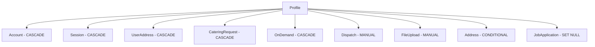

# User Deletion Development Guide

## Overview

This guide provides comprehensive information for developers working on the user deletion functionality, including implementation details, best practices, and troubleshooting guidelines.

## Architecture Overview

### Component Structure

```
src/app/api/users/[userId]/route.ts    # Main deletion endpoint
├── Authentication & Authorization     # Supabase JWT validation
├── Pre-deletion Validation           # Business logic checks
├── Transaction Management             # Database operations
├── Manual Cleanup Operations          # Explicit relationship handling
├── Cascade Deletion Triggers          # Automatic cleanup
├── Audit Trail Generation            # Compliance logging
└── Error Handling & Response         # Comprehensive error management
```

### Database Schema Integration



## Implementation Details

### Core Deletion Logic

#### 1. Authentication & Authorization

```typescript
// Authentication validation
const supabase = await createClient();
const {
  data: { user },
} = await supabase.auth.getUser();

if (!user) {
  return NextResponse.json(
    { error: "Authentication required" },
    { status: 401 },
  );
}

// Authorization validation
const requesterProfile = await prisma.profile.findUnique({
  where: { id: user.id },
  select: { type: true },
});

if (
  !requesterProfile ||
  !["ADMIN", "SUPER_ADMIN"].includes(requesterProfile.type)
) {
  return NextResponse.json(
    { error: "Insufficient permissions" },
    { status: 403 },
  );
}
```

#### 2. Pre-deletion Validation

```typescript
// User existence check
const userToDelete = await prisma.profile.findUnique({
  where: { id: userId },
  select: { type: true, email: true },
});

if (!userToDelete) {
  return NextResponse.json({ error: "User not found" }, { status: 404 });
}

// Self-deletion prevention
if (user.id === userId) {
  return NextResponse.json(
    { error: "Self-deletion is not allowed" },
    { status: 403 },
  );
}

// SUPER_ADMIN protection
if (userToDelete.type === "SUPER_ADMIN") {
  return NextResponse.json(
    { error: "SUPER_ADMIN users cannot be deleted" },
    { status: 403 },
  );
}

// Active orders check
const [activeCateringOrders, activeOnDemandOrders] = await Promise.all([
  prisma.cateringRequest.count({
    where: { userId, status: { in: ["PENDING", "CONFIRMED", "IN_PROGRESS"] } },
  }),
  prisma.onDemand.count({
    where: { userId, status: { in: ["PENDING", "CONFIRMED", "IN_PROGRESS"] } },
  }),
]);

if (activeCateringOrders > 0 || activeOnDemandOrders > 0) {
  return NextResponse.json(
    {
      error: "Cannot delete user with active orders",
      code: "ACTIVE_ORDERS_EXIST",
      details: `User has ${activeCateringOrders} active catering orders and ${activeOnDemandOrders} active on-demand orders`,
      activeOrders: {
        cateringOrders: activeCateringOrders,
        onDemandOrders: activeOnDemandOrders,
      },
    },
    { status: 409 },
  );
}
```

#### 3. Transaction Management

```typescript
const result = await prisma.$transaction(
  async (tx: PrismaTransaction) => {
    // Manual cleanup operations
    const deletedDispatches = await tx.dispatch.deleteMany({
      where: { OR: [{ driverId: userId }, { userId }] },
    });

    const updatedFileUploads = await tx.fileUpload.updateMany({
      where: { userId },
      data: { userId: null },
    });

    // Address handling with conditional logic
    const addressesCreatedByUser = await tx.address.findMany({
      where: { createdBy: userId },
      include: {
        userAddresses: { select: { userId: true } },
        cateringPickupRequests: { select: { id: true } },
        cateringDeliveryRequests: { select: { id: true } },
        onDemandPickupRequests: { select: { id: true } },
        onDemandDeliveryRequests: { select: { id: true } },
      },
    });

    let deletedAddresses = 0;
    let updatedAddresses = 0;

    for (const address of addressesCreatedByUser) {
      const isUsedByOthers =
        address.userAddresses.some((ua) => ua.userId !== userId) ||
        address.cateringPickupRequests.length > 0 ||
        address.cateringDeliveryRequests.length > 0 ||
        address.onDemandPickupRequests.length > 0 ||
        address.onDemandDeliveryRequests.length > 0;

      if (!isUsedByOthers) {
        await tx.address.delete({ where: { id: address.id } });
        deletedAddresses++;
      } else {
        await tx.address.update({
          where: { id: address.id },
          data: { createdBy: null },
        });
        updatedAddresses++;
      }
    }

    // Profile deletion (triggers cascades)
    const deletedProfile = await tx.profile.delete({
      where: { id: userId },
    });

    return {
      deletedProfile,
      deletedDispatches: deletedDispatches.count,
      updatedFileUploads: updatedFileUploads.count,
      deletedAddresses,
      updatedAddresses,
      totalAddressesProcessed: deletedAddresses + updatedAddresses,
    };
  },
  { timeout: 10000 },
);
```

### Error Handling Strategy

#### Error Classification

```typescript
// Prisma-specific error handling
if (error instanceof Prisma.PrismaClientKnownRequestError) {
  switch (error.code) {
    case "P2025":
      return NextResponse.json(
        {
          error: "User not found or already deleted",
          code: "USER_NOT_FOUND",
        },
        { status: 404 },
      );

    case "P2003":
      return NextResponse.json(
        {
          error: "Database constraint violation",
          code: "CONSTRAINT_VIOLATION",
        },
        { status: 500 },
      );

    case "P2002":
      return NextResponse.json(
        {
          error: "Unique constraint violation",
          code: "UNIQUE_CONSTRAINT_VIOLATION",
        },
        { status: 409 },
      );

    case "P1001":
    case "P2024":
      return NextResponse.json(
        {
          error: "Database connection failed",
          code: "DATABASE_CONNECTION_ERROR",
        },
        { status: 503 },
      );
  }
}

// Transaction timeout handling
if (
  error.message?.includes("timeout") ||
  error.message?.includes("timed out")
) {
  return NextResponse.json(
    {
      error: "Deletion operation timed out",
      code: "TRANSACTION_TIMEOUT",
    },
    { status: 408 },
  );
}
```

#### Audit Trail Generation

```typescript
// Success audit log
console.log(
  "[AUDIT] User deletion completed:",
  JSON.stringify({
    action: "USER_DELETION",
    performedBy: user.id,
    performedByType: requesterProfile?.type,
    targetUserId: userId,
    targetUserEmail: userToDelete?.email,
    targetUserType: userToDelete?.type,
    affectedRecords: result,
    timestamp: new Date().toISOString(),
    ipAddress: request.headers.get("x-forwarded-for") || "unknown",
    userAgent: request.headers.get("user-agent") || "unknown",
    success: true,
    duration: `${Date.now() - startTime}ms`,
  }),
);

// Error audit log
console.log(
  "[AUDIT] User deletion failed:",
  JSON.stringify({
    action: "USER_DELETION_FAILED",
    performedBy: user?.id || "unknown",
    performedByType: requesterProfile?.type || "unknown",
    targetUserId: userId || "unknown",
    targetUserEmail: userToDelete?.email || "unknown",
    targetUserType: userToDelete?.type || "unknown",
    error: error.message,
    errorCode: error.code || "UNKNOWN_ERROR",
    timestamp: new Date().toISOString(),
    ipAddress: request.headers.get("x-forwarded-for") || "unknown",
    userAgent: request.headers.get("user-agent") || "unknown",
    success: false,
    duration: `${Date.now() - startTime}ms`,
  }),
);
```

## Development Best Practices

### Code Organization

#### 1. Variable Scoping

```typescript
// Declare variables at function scope for error handling access
let startTime: number;
let userId: string;
let user: any;
let requesterProfile: any;
let userToDelete: any;

try {
  startTime = Date.now();
  // ... implementation
} catch (error) {
  // Variables are accessible here for audit logging
}
```

#### 2. Type Safety

```typescript
import { PrismaTransaction } from "@/types/prisma-types";

// Use proper typing for transaction parameter
await prisma.$transaction(async (tx: PrismaTransaction) => {
  // Type-safe database operations
});
```

#### 3. Error Response Consistency

```typescript
// Consistent error response structure
interface ErrorResponse {
  error: string;
  code?: string;
  details?: string;
  [key: string]: any;
}

const createErrorResponse = (
  error: string,
  status: number,
  code?: string,
  details?: string,
  additional?: Record<string, any>,
): NextResponse => {
  return NextResponse.json(
    {
      error,
      ...(code && { code }),
      ...(details && { details }),
      ...additional,
    },
    { status },
  );
};
```

### Performance Optimization

#### 1. Query Optimization

```typescript
// Efficient user existence and type check
const userToDelete = await prisma.profile.findUnique({
  where: { id: userId },
  select: {
    type: true,
    email: true,
    // Only select needed fields
  },
});

// Parallel active orders check
const [activeCateringOrders, activeOnDemandOrders] = await Promise.all([
  prisma.cateringRequest.count({
    where: {
      userId,
      status: { in: ["PENDING", "CONFIRMED", "IN_PROGRESS"] },
    },
  }),
  prisma.onDemand.count({
    where: {
      userId,
      status: { in: ["PENDING", "CONFIRMED", "IN_PROGRESS"] },
    },
  }),
]);
```

#### 2. Transaction Optimization

```typescript
// Optimal deletion order within transaction
await prisma.$transaction(
  async (tx) => {
    // 1. Delete dependent records first (dispatches)
    // 2. Update foreign key references (file uploads)
    // 3. Handle conditional deletions (addresses)
    // 4. Delete main record last (profile - triggers cascades)
  },
  {
    timeout: 10000, // 10 second timeout
    isolationLevel: "ReadCommitted", // Optimal for deletion operations
  },
);
```

### Testing Considerations

#### 1. Unit Test Structure

```typescript
describe("DELETE /api/users/[userId]", () => {
  beforeEach(() => {
    jest.clearAllMocks();
  });

  describe("Authorization Tests", () => {
    test("should allow ADMIN to delete users", async () => {
      // Test implementation
    });

    test("should prevent SUPER_ADMIN deletion", async () => {
      // Test implementation
    });
  });

  describe("Data Integrity Tests", () => {
    test("should handle cascade deletions correctly", async () => {
      // Test implementation
    });
  });
});
```

#### 2. Mock Strategy

```typescript
// Mock Prisma client
const mockPrisma = {
  profile: {
    findUnique: jest.fn(),
    delete: jest.fn(),
  },
  $transaction: jest.fn(),
  // ... other methods
};

// Mock Supabase client
const mockSupabase = {
  auth: {
    getUser: jest.fn(),
  },
};
```

## Debugging and Troubleshooting

### Common Issues

#### 1. Transaction Timeouts

**Symptoms**: 408 error responses, timeout error messages
**Causes**: Large datasets, database locks, connection issues
**Solutions**:

```typescript
// Increase timeout for complex deletions
await prisma.$transaction(
  async (tx) => {
    // operations
  },
  { timeout: 15000 },
); // 15 seconds

// Add progress logging
console.log("[DEBUG] Starting dispatch deletion...");
await tx.dispatch.deleteMany({
  where: { OR: [{ driverId: userId }, { userId }] },
});
console.log("[DEBUG] Dispatch deletion completed");
```

#### 2. Orphaned Records

**Symptoms**: Data integrity validation failures
**Causes**: Incomplete transaction rollback, missing cascade rules
**Solutions**:

```typescript
// Add explicit cleanup verification
const orphanCheck = await prisma.dispatch.count({
  where: { OR: [{ driverId: userId }, { userId }] },
});

if (orphanCheck > 0) {
  console.error(
    `[ERROR] Found ${orphanCheck} orphaned dispatch records for user ${userId}`,
  );
}
```

#### 3. Performance Issues

**Symptoms**: Slow response times, high memory usage
**Causes**: Inefficient queries, large datasets, missing indexes
**Solutions**:

```typescript
// Use selective field retrieval
const addresses = await tx.address.findMany({
  where: { createdBy: userId },
  select: {
    id: true,
    // Only select necessary fields
    userAddresses: { select: { userId: true } },
  },
});

// Batch process large datasets
const BATCH_SIZE = 100;
for (let i = 0; i < addresses.length; i += BATCH_SIZE) {
  const batch = addresses.slice(i, i + BATCH_SIZE);
  await processBatch(batch);
}
```

### Debug Logging

#### Enable Debug Mode

```typescript
const DEBUG =
  process.env.NODE_ENV === "development" || process.env.DEBUG === "true";

if (DEBUG) {
  console.log("[DEBUG] Starting user deletion process", {
    userId,
    performedBy: user.id,
    timestamp: new Date().toISOString(),
  });
}
```

#### Performance Timing

```typescript
const timer = {
  start: Date.now(),
  mark: (label: string) => {
    const elapsed = Date.now() - timer.start;
    console.log(`[TIMING] ${label}: ${elapsed}ms`);
  },
};

timer.mark("Authorization completed");
// ... operations
timer.mark("Transaction completed");
```

## Security Considerations

### Input Validation

```typescript
// UUID format validation
const uuidRegex =
  /^[0-9a-f]{8}-[0-9a-f]{4}-4[0-9a-f]{3}-[89ab][0-9a-f]{3}-[0-9a-f]{12}$/i;

if (!uuidRegex.test(userId)) {
  return NextResponse.json(
    {
      error: "Invalid user ID format",
      code: "INVALID_USER_ID",
    },
    { status: 400 },
  );
}
```

### SQL Injection Prevention

```typescript
// Always use parameterized queries
const result = await prisma.profile.findUnique({
  where: { id: userId }, // Prisma handles parameterization
});

// Never use string concatenation
// BAD: `SELECT * FROM profiles WHERE id = '${userId}'`
// GOOD: Prisma's parameterized queries
```

### Authorization Best Practices

```typescript
// Always verify both authentication and authorization
const [authUser, requesterProfile] = await Promise.all([
  supabase.auth.getUser(),
  prisma.profile.findUnique({
    where: { id: user.id },
    select: { type: true },
  }),
]);

// Multiple authorization checks
const hasPermission =
  requesterProfile &&
  ["ADMIN", "SUPER_ADMIN"].includes(requesterProfile.type) &&
  user.id !== userId && // Self-deletion check
  userToDelete.type !== "SUPER_ADMIN"; // SUPER_ADMIN protection
```

## Monitoring Integration

### Performance Metrics

```typescript
// Record operation metrics
const metrics = {
  operation: "user_deletion",
  userId,
  performedBy: user.id,
  duration: Date.now() - startTime,
  recordsAffected: {
    profiles: 1,
    dispatches: result.deletedDispatches,
    fileUploads: result.updatedFileUploads,
    addresses: result.deletedAddresses + result.updatedAddresses,
  },
  success: true,
  timestamp: new Date().toISOString(),
};

// Send to monitoring system
// await sendMetrics(metrics);
```

### Error Tracking

```typescript
// Structured error reporting
const errorReport = {
  error: error.message,
  code: error.code,
  stack: error.stack,
  context: {
    userId,
    performedBy: user?.id,
    operation: "user_deletion",
    timestamp: new Date().toISOString(),
  },
};

// Send to error tracking service
// await reportError(errorReport);
```

## Deployment Considerations

### Environment Configuration

```bash
# Production settings
DATABASE_CONNECTION_LIMIT=20
TRANSACTION_TIMEOUT=10000
ENABLE_DEBUG_LOGGING=false

# Development settings
DATABASE_CONNECTION_LIMIT=5
TRANSACTION_TIMEOUT=15000
ENABLE_DEBUG_LOGGING=true
```

### Database Migration Requirements

```sql
-- Ensure proper cascade delete constraints
ALTER TABLE accounts
DROP CONSTRAINT IF EXISTS accounts_user_id_fkey,
ADD CONSTRAINT accounts_user_id_fkey
  FOREIGN KEY (user_id) REFERENCES profiles(id) ON DELETE CASCADE;

-- Add indexes for performance
CREATE INDEX IF NOT EXISTS idx_dispatches_driver_id ON dispatches(driver_id);
CREATE INDEX IF NOT EXISTS idx_dispatches_user_id ON dispatches(user_id);
CREATE INDEX IF NOT EXISTS idx_file_uploads_user_id ON file_uploads(user_id);
```

## Future Enhancements

### Planned Improvements

1. **Soft Delete Option**: Configurable soft delete for audit requirements
2. **Batch Deletion**: Support for deleting multiple users
3. **Async Processing**: Queue-based deletion for large datasets
4. **Advanced Monitoring**: Real-time performance dashboards

### API Evolution

- **Version 2**: Add soft delete capability
- **Version 3**: Implement batch operations
- **Version 4**: Add advanced scheduling options

---

## Related Resources

- [API Documentation](../api/user-deletion-endpoint.md)
- [Testing Guide](../testing/user-deletion-testing-guide.md)
- [Deployment Strategy](../deployment/user-deletion-deployment-strategy.md)
- [Monitoring Strategy](../monitoring/post-deployment-monitoring-strategy.md)
- [Database Schema](../database/schema-relationships.md)
