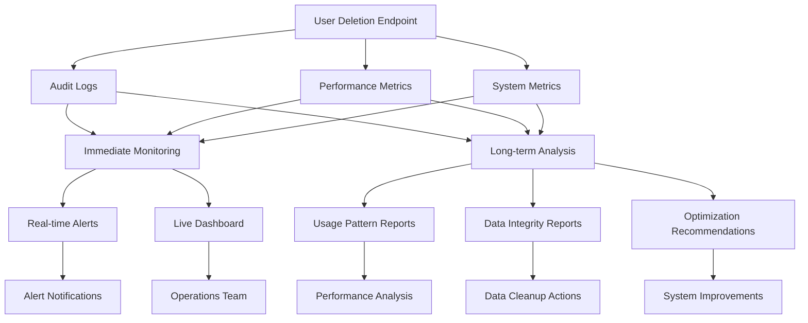
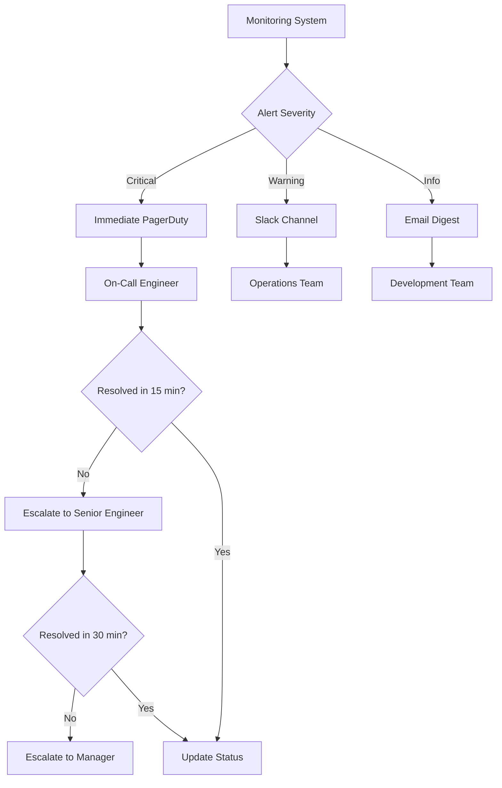

# Post-Deployment Monitoring Strategy for User Deletion Endpoint

## Overview

This document outlines the comprehensive post-deployment monitoring strategy for the user deletion endpoint (`DELETE /api/users/[userId]`). The monitoring approach is designed to ensure system reliability, data integrity, and optimal performance following production deployment.

## 🔍 PHASE 6: POST-DEPLOYMENT MONITORING

### 6.1 Immediate Monitoring (24-48 hours)

The immediate monitoring phase focuses on real-time system health and early issue detection during the critical post-deployment period.

#### Error Rate Monitoring ✅

**Objective**: Track deletion success/failure rates and identify unusual error patterns.

**Key Metrics**:

- **Success Rate**: Target > 99%
- **Error Rate**: Alert threshold < 1%
- **Failure Classification**: Categorize by error type (timeout, authorization, business logic)
- **Error Trends**: Monitor rate of change in error patterns

**Implementation**:

```bash
# Start immediate monitoring with error rate tracking
pnpm monitor:immediate

# Custom error rate threshold (0.5%)
ERROR_RATE_THRESHOLD=0.5 pnpm monitor:immediate
```

**Alert Conditions**:

- Error rate > 1% for 5 minutes = Critical Alert
- Error rate > 0.5% for 10 minutes = Warning Alert
- Timeout errors > 5 per hour = Performance Alert
- Authorization failures > 10 per hour = Security Alert

#### Performance Monitoring ✅

**Objective**: Monitor deletion operation response times, database performance, and system resources.

**Key Metrics**:

- **Response Times**: Average, P95, P99 deletion operation times
- **Database Performance**: Connection pool usage, query execution times
- **System Resources**: Memory usage, CPU utilization, disk I/O
- **Transaction Timeouts**: Frequency and patterns of timeout occurrences

**Performance Targets**:

- Average deletion time: < 2 seconds
- P95 deletion time: < 5 seconds
- Database connection pool usage: < 80%
- Memory usage increase: < 20% from baseline

**Implementation**:

```bash
# Monitor with custom response time threshold (3 seconds)
RESPONSE_TIME_THRESHOLD=3000 pnpm monitor:immediate

# Custom check interval for high-frequency monitoring
CHECK_INTERVAL=30 pnpm monitor:immediate
```

#### Memory Usage During Complex Deletions ✅

**Objective**: Track memory consumption patterns during various deletion scenarios.

**Monitoring Approach**:

- **Baseline Memory Usage**: Establish pre-deletion memory baseline
- **Peak Memory Tracking**: Monitor memory spikes during complex operations
- **Garbage Collection Impact**: Track GC frequency and duration
- **Memory Leak Detection**: Identify gradual memory increases

**Alert Thresholds**:

- Memory usage > 90% = Critical Alert
- Memory usage > 80% = Warning Alert
- Memory increase > 30% from baseline = Investigation Alert

---

### 6.2 Long-term Monitoring (1-4 weeks)

The long-term monitoring phase focuses on data integrity validation, usage pattern analysis, and optimization opportunity identification.

#### Data Integrity Validation ✅

**Objective**: Ensure deletion operations maintain data consistency and completeness.

**Validation Categories**:

1. **Random Audits of Deletion Completeness**
   - Sample recent successful deletions
   - Verify complete removal of user profile
   - Validate proper cascade deletion execution
   - Confirm manual cleanup completion

2. **Orphaned Record Detection Queries**
   - Scan for foreign key constraint violations
   - Identify orphaned accounts, sessions, user addresses
   - Detect improperly cleaned Dispatch records
   - Find FileUpload records with invalid user references

3. **User Feedback on Deletion Behavior**
   - Monitor support tickets related to deletion issues
   - Track user reports of incomplete deletions
   - Analyze system-generated error notifications

**Implementation**:

```bash
# Run comprehensive data integrity validation
pnpm monitor:data-integrity

# Daily automated integrity checks
crontab -e
0 6 * * * cd /path/to/ready-set && pnpm monitor:data-integrity
```

**Validation Schedule**:

- **Daily**: Orphaned record scans during first week
- **Weekly**: Comprehensive integrity validation
- **Ad-hoc**: After any system maintenance or updates

#### Usage Pattern Analysis ✅

**Objective**: Identify deletion frequency patterns, common failure scenarios, and performance optimization opportunities.

**Analysis Categories**:

1. **Deletion Frequency Patterns**
   - Daily, weekly, and monthly usage trends
   - Peak usage times and load distribution
   - Seasonal or business cycle correlations
   - User type deletion patterns

2. **Most Common Failure Scenarios**
   - Failure type classification and frequency
   - Root cause analysis of recurring issues
   - User behavior patterns leading to failures
   - System capacity correlation with failures

3. **Performance Optimization Opportunities**
   - Slow deletion operation identification
   - Resource utilization pattern analysis
   - Database query optimization candidates
   - Caching and batching opportunities

**Implementation**:

```bash
# Generate comprehensive usage pattern analysis
pnpm monitor:usage-patterns

# Weekly analysis reports
crontab -e
0 9 * * 1 cd /path/to/ready-set && pnpm monitor:usage-patterns
```

**Analysis Outputs**:

- **Usage Pattern Reports**: Detailed analysis of deletion trends
- **Performance Recommendations**: Specific optimization suggestions
- **Failure Analysis**: Classification and mitigation strategies
- **Capacity Planning**: Resource requirement projections

---

## Monitoring Architecture

### Data Collection Pipeline



### Monitoring Components

#### 1. Immediate Monitoring System ✅

- **Real-time Dashboard**: Live console with color-coded status indicators
- **Automated Alerting**: Threshold-based notifications via Slack, email, PagerDuty
- **Metrics Collection**: Structured JSON logs with comprehensive metadata
- **Performance Tracking**: Response time, error rate, and resource utilization

#### 2. Data Integrity Validation System ✅

- **Automated Scanning**: Scheduled integrity checks with configurable frequency
- **Violation Detection**: Foreign key, cascade deletion, and consistency validation
- **Audit Trail Verification**: Completeness and accuracy of deletion logs
- **Remediation Recommendations**: Specific actions for identified issues

#### 3. Usage Pattern Analysis System ✅

- **Trend Analysis**: Historical pattern identification and prediction
- **Failure Classification**: Systematic categorization of error scenarios
- **Performance Profiling**: Resource usage and optimization opportunity identification
- **Behavioral Analysis**: User interaction patterns and workflow optimization

#### 4. Long-term Monitoring Orchestration ✅

- **Continuous Monitoring**: Extended observation periods with summary reporting
- **Automated Report Generation**: Weekly and monthly comprehensive reports
- **Trend Detection**: Statistical analysis of performance and reliability trends
- **Predictive Analytics**: Early warning systems for potential issues

---

## Alert Management Strategy

### Alert Severity Levels

#### Critical Alerts (Immediate Response Required)

- **Error Rate > 2%**: System-wide deletion failures
- **Response Time > 10 seconds**: Severe performance degradation
- **Memory Usage > 90%**: Resource exhaustion risk
- **Data Integrity Violations > 10**: Significant consistency issues

#### Warning Alerts (Investigation Required)

- **Error Rate > 1%**: Elevated failure rates
- **Response Time > 5 seconds**: Performance degradation
- **Memory Usage > 80%**: Resource pressure
- **Data Integrity Violations > 5**: Consistency concerns

#### Information Alerts (Monitoring Required)

- **Error Rate > 0.5%**: Slight increase in failures
- **Response Time > 3 seconds**: Minor performance impact
- **Unusual Usage Patterns**: Significant trend changes

### Alert Routing and Escalation



### Alert Configuration

**Slack Integration**:

```bash
export SLACK_WEBHOOK_URL="https://hooks.slack.com/services/..."
# Alerts sent to #ops-alerts channel
```

**PagerDuty Integration**:

```bash
export PAGERDUTY_KEY="your-integration-key"
# Critical alerts trigger immediate pages
```

**Email Notifications**:

```bash
export ALERT_EMAIL="ops@ready-set.app"
# Daily digest and warning alerts
```

---

## Performance Optimization Framework

### Continuous Improvement Process

#### 1. Performance Baseline Establishment

- **Initial Metrics Collection**: First 48 hours of comprehensive data
- **Baseline Calculation**: Statistical analysis of normal operation ranges
- **Threshold Calibration**: Alert threshold adjustment based on observed patterns

#### 2. Trend Analysis and Pattern Recognition

- **Performance Trend Identification**: Statistical analysis of performance over time
- **Seasonal Pattern Recognition**: Business cycle and usage pattern correlation
- **Anomaly Detection**: Identification of unusual patterns requiring investigation

#### 3. Optimization Opportunity Identification

- **Slow Operation Analysis**: Detailed profiling of high-latency deletions
- **Resource Utilization Review**: Memory, CPU, and database usage optimization
- **Query Performance Analysis**: Database query optimization opportunities

#### 4. Implementation and Validation

- **Optimization Implementation**: Performance improvement deployment
- **A/B Testing**: Controlled validation of optimization effectiveness
- **Performance Validation**: Measurement of improvement impact

### Optimization Recommendations Engine

**Automated Analysis**:

```bash
# Generate optimization recommendations
pnpm monitor:usage-patterns

# Sample output:
{
  "optimization_recommendations": {
    "performance_optimization": [
      "Consider database query optimization for complex deletions",
      "Implement deletion operation batching for bulk operations"
    ],
    "failure_reduction": [
      "Improve error handling for timeout scenarios",
      "Enhance user feedback for authorization failures"
    ],
    "monitoring_improvements": [
      "Implement predictive alerting for peak usage times",
      "Add correlation analysis between user types and performance"
    ]
  }
}
```

---

## Compliance and Audit Requirements

### Audit Trail Management

#### Data Retention Policies

- **Monitoring Logs**: 90 days retention for operational analysis
- **Audit Logs**: 7 years retention for compliance requirements
- **Performance Metrics**: 1 year retention for trend analysis
- **Integrity Reports**: 2 years retention for compliance validation

#### Compliance Validation

- **GDPR Compliance**: Verification of complete data deletion
- **CCPA Compliance**: Validation of consumer data removal
- **SOX Compliance**: Audit trail completeness and integrity
- **HIPAA Compliance**: Healthcare data deletion verification (if applicable)

### Reporting Requirements

#### Operational Reports

- **Daily Health Reports**: System status and performance summary
- **Weekly Trend Reports**: Performance and reliability trends
- **Monthly Compliance Reports**: Audit trail and integrity validation
- **Quarterly Review Reports**: Comprehensive system assessment

#### Executive Dashboards

- **KPI Monitoring**: Key performance indicator tracking
- **SLA Compliance**: Service level agreement adherence
- **Risk Assessment**: System reliability and security metrics
- **Business Impact**: User satisfaction and operational efficiency

---

## Disaster Recovery and Business Continuity

### Monitoring System Resilience

#### Redundancy and Failover

- **Multi-Region Monitoring**: Monitoring system deployment across multiple regions
- **Failover Automation**: Automatic failover to backup monitoring systems
- **Data Replication**: Real-time replication of monitoring data
- **Alert Redundancy**: Multiple alert delivery channels

#### Recovery Procedures

- **System Recovery**: Step-by-step monitoring system restoration
- **Data Recovery**: Historical data restoration from backups
- **Alert System Recovery**: Alert notification system restoration
- **Validation Procedures**: Post-recovery system validation

### Business Continuity Planning

#### Impact Assessment

- **Service Impact**: Effect of monitoring system downtime on operations
- **Data Loss Impact**: Consequences of monitoring data loss
- **Alert Delay Impact**: Effect of delayed alert notifications
- **Recovery Time Objectives**: Target time for system restoration

#### Contingency Procedures

- **Manual Monitoring**: Procedures for manual system monitoring
- **Alternative Alerting**: Backup alert notification methods
- **Emergency Contacts**: Escalation procedures during monitoring outages
- **Communication Plans**: Status communication during incidents

---

## Success Metrics and KPIs

### System Reliability Metrics

#### Availability Targets

- **System Uptime**: > 99.9% availability
- **Monitoring Coverage**: 100% operation monitoring
- **Alert Accuracy**: < 2% false positive rate
- **Response Time**: < 5 minutes mean time to alert

#### Performance Targets

- **Deletion Success Rate**: > 99%
- **Average Response Time**: < 2 seconds
- **P95 Response Time**: < 5 seconds
- **System Resource Utilization**: < 70% average

### Data Integrity Metrics

#### Data Quality Targets

- **Orphaned Records**: 0 tolerance
- **Audit Coverage**: 100% operation logging
- **Integrity Violations**: 0 tolerance
- **Compliance Adherence**: 100% regulatory compliance

#### Process Efficiency Metrics

- **Detection Time**: < 15 minutes for integrity issues
- **Resolution Time**: < 4 hours for data integrity issues
- **Automation Rate**: > 95% automated monitoring coverage
- **Manual Intervention**: < 5% of operations requiring manual intervention

---

## Future Enhancements

### Planned Improvements

#### Advanced Analytics

- **Machine Learning Integration**: Predictive failure detection
- **Anomaly Detection**: Advanced pattern recognition for unusual behavior
- **Capacity Planning**: Automated resource requirement prediction
- **Performance Prediction**: Proactive performance degradation detection

#### Enhanced Automation

- **Self-Healing Systems**: Automated remediation for common issues
- **Dynamic Scaling**: Automatic resource scaling based on load patterns
- **Intelligent Alerting**: Context-aware alert prioritization
- **Automated Optimization**: Self-tuning system parameters

#### Integration Expansions

- **External Monitoring Tools**: Integration with enterprise monitoring solutions
- **Business Intelligence**: Integration with BI tools for executive reporting
- **Customer Communication**: Automated customer notification systems
- **Third-Party Services**: Integration with external audit and compliance services

---

## Summary

The post-deployment monitoring strategy for the user deletion endpoint provides comprehensive coverage of system health, data integrity, and performance optimization. Through immediate monitoring, long-term analysis, and continuous improvement processes, the strategy ensures reliable, efficient, and compliant user deletion operations.

**Key Achievements**:

- ✅ **Immediate Monitoring (24-48 hours)**: Real-time error rate and performance tracking
- ✅ **Long-term Monitoring (1-4 weeks)**: Data integrity validation and usage pattern analysis
- ✅ **Automated Alerting**: Threshold-based notifications with escalation procedures
- ✅ **Comprehensive Reporting**: Detailed analysis and optimization recommendations
- ✅ **Compliance Framework**: Audit trail management and regulatory compliance
- ✅ **Performance Optimization**: Continuous improvement and optimization identification

The monitoring strategy ensures that the user deletion endpoint operates reliably in production while maintaining data integrity and providing insights for continuous improvement.
