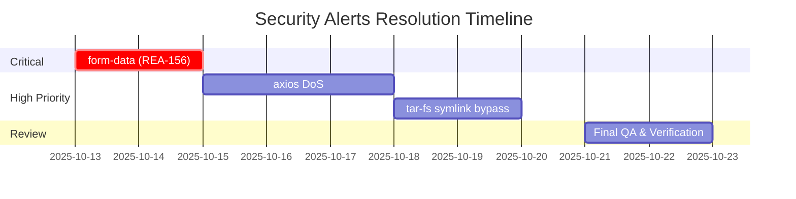

# Security Alerts Resolution - Critical & High Dependabot
**Project**: [Security Alerts Resolution](https://linear.app/ready-set-llc/project/security-alerts-resolution-critical-b088d4f0e516/overview)
**Timeline**: 2 weeks (October 13 - October 27, 2025)
**Priority**: P0 (Critical Security Issues)

---

## 📊 Overview

**Total Alerts to Fix**: 3 unique vulnerabilities (4 alerts)
- 1 Critical: form-data
- 2 High: axios, tar-fs (2 alerts)

---

## 🎯 Milestone 1: Critical - form-data Unsafe Random Function
**Due Date**: October 17, 2025 (This Week)
**Linear Issue**: [REA-156](https://linear.app/ready-set-llc/issue/REA-156)
**GitHub Alert**: [#2](https://github.com/ReadySet1/ready-set/security/dependabot/2)

### Details
- **Package**: form-data
- **CVE**: CVE-2025-7783
- **Severity**: Critical
- **Issue**: Uses unsafe random function for choosing boundary in multipart/form-data
- **Impact**: Potential for predictable boundary values, leading to request manipulation

### Tasks
- [ ] Review Dependabot PR or create manual PR to update form-data
- [ ] Test file upload functionality across all features:
  - [ ] Profile picture uploads
  - [ ] Document uploads in catering requests
  - [ ] Any other file upload endpoints
- [ ] Run full test suite: `pnpm test`
- [ ] Run build to check for breaking changes: `pnpm build`
- [ ] Deploy to preview environment for QA
- [ ] Merge and deploy to production

### Acceptance Criteria
- ✅ form-data package updated to patched version
- ✅ All tests pass
- ✅ Build succeeds without errors
- ✅ File uploads work in preview environment
- ✅ Alert #2 marked as closed in GitHub

### Estimated Time
2-3 hours

---

## 🎯 Milestone 2: High - axios DoS Vulnerability
**Due Date**: October 22, 2025 (Next Week)
**GitHub Alert**: [#10](https://github.com/ReadySet1/ready-set/security/dependabot/10)

### Details
- **Package**: axios
- **CVE**: CVE-2025-58754
- **Severity**: High
- **Issue**: Vulnerable to DoS attack through lack of data size check
- **Impact**: Attackers could cause denial of service by sending large payloads

### Tasks
- [ ] Review current axios usage in the codebase
- [ ] Check Dependabot PR or create manual update PR
- [ ] Test all API calls:
  - [ ] Supabase client requests
  - [ ] External API integrations (if any)
  - [ ] Internal API routes
- [ ] Consider adding request size limits at the application level
- [ ] Run full test suite: `pnpm test`
- [ ] Run TypeScript check: `pnpm typecheck`
- [ ] Deploy to preview environment
- [ ] Monitor for any regression issues

### Acceptance Criteria
- ✅ axios updated to patched version (check for v1.7.9+ or latest)
- ✅ All HTTP requests working correctly
- ✅ Tests pass
- ✅ TypeScript compilation successful
- ✅ Preview deployment verified
- ✅ Alert #10 marked as closed in GitHub

### Estimated Time
3-4 hours

---

## 🎯 Milestone 3: High - tar-fs Symlink Validation Bypass
**Due Date**: October 24, 2025 (Next Week)
**GitHub Alerts**: [#7](https://github.com/ReadySet1/ready-set/security/dependabot/7), [#8](https://github.com/ReadySet1/ready-set/security/dependabot/8)

### Details
- **Package**: tar-fs
- **CVE**: CVE-2025-59343
- **Severity**: High
- **Issue**: Symlink validation bypass if destination directory is predictable with specific tarball
- **Impact**: Potential for directory traversal attacks during archive extraction
- **Note**: This appears twice (alerts #7 and #8) - likely in different dependency trees

### Tasks
- [ ] Identify where tar-fs is used (likely dev dependency or transitive)
- [ ] Check if direct or transitive dependency
- [ ] Review Dependabot PR or create manual update
- [ ] Verify no archive extraction features in production code
- [ ] If found, audit extraction logic for security
- [ ] Update tar-fs to patched version
- [ ] Run full test suite: `pnpm test`
- [ ] Check for any build/deployment process dependencies
- [ ] Verify CI/CD pipeline still works

### Acceptance Criteria
- ✅ tar-fs updated to patched version
- ✅ Both alerts (#7 and #8) resolved
- ✅ No breaking changes in dev tools
- ✅ CI/CD pipeline runs successfully
- ✅ Tests pass
- ✅ Both alerts marked as closed in GitHub

### Estimated Time
2-3 hours

---

## 📅 Timeline Summary

---

## 🚀 Implementation Order

1. **Week 1 (Oct 13-17)**: Fix Critical form-data issue (REA-156)
2. **Week 2 (Oct 18-22)**: Fix High severity axios issue
3. **Week 2 (Oct 22-24)**: Fix High severity tar-fs issue
4. **Week 2 (Oct 24-27)**: Final verification and monitoring

---

## ✅ Success Metrics

- [ ] All 4 Dependabot alerts (#2, #7, #8, #10) closed
- [ ] Zero regression bugs introduced
- [ ] All automated tests passing
- [ ] Production deployment successful
- [ ] No new security alerts introduced
- [ ] Documentation updated

---

## 🔄 Post-Resolution

### Monitoring (1 week after completion)
- Monitor error logs for any issues
- Check application performance metrics
- Verify no new security alerts
- Update security documentation

### Prevention
- Enable Dependabot auto-updates for patch versions
- Set up weekly security alert reviews
- Consider adding automated security scanning in CI/CD

---

## 📞 Contact & Resources

- **GitHub Security Alerts**: https://github.com/ReadySet1/ready-set/security
- **Linear Project**: https://linear.app/ready-set-llc/project/security-alerts-resolution-critical-b088d4f0e516
- **Dependabot Dashboard**: https://github.com/ReadySet1/ready-set/security/dependabot

---

## Notes

- Test thoroughly in preview environment before production
- Coordinate with team before merging critical updates
- Keep stakeholders informed of progress
- Document any breaking changes or workarounds needed
